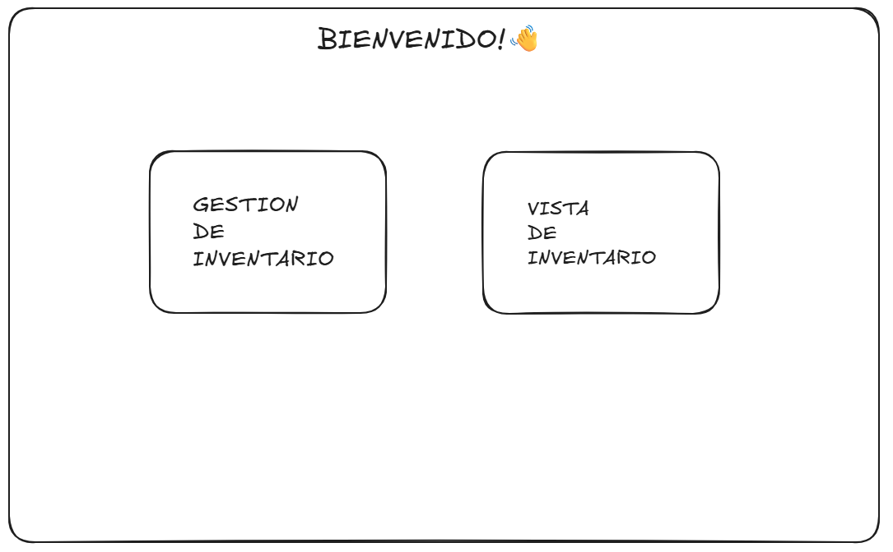

# Diseño del Sistema

[Requerimientos](https://www.notion.so/Requerimientos-2d5b676d5eda80b8b63bdc648229dde2?pvs=21)

[Casos de Uso](https://www.notion.so/Casos-de-Uso-2d5b676d5eda80c2bb4cd3f9c734fdbe?pvs=21)

[Modelo De Datos](https://www.notion.so/Modelo-De-Datos-2d5b676d5eda801da83be032e9ab31c4?pvs=21)

[Ideas Futuras](https://www.notion.so/Ideas-Futuras-2d5b676d5eda80cfad52d9315f1740ae?pvs=21)

### **DIAGRAMA DE PAGINAS Y SUBPAGINAS**

### **Inicial:**

### **Gestion De Inventario:**

Productos:

Ventas:

Ajustes:

